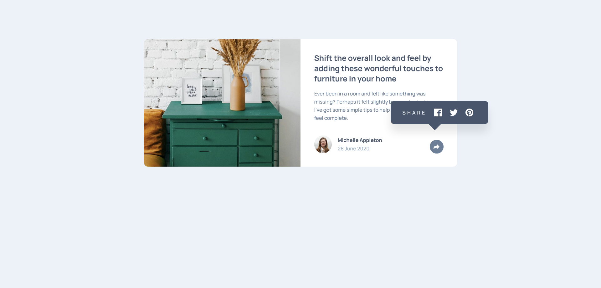

# Frontend Mentor - Article preview component solution

This is a solution to the [Article preview component challenge on Frontend Mentor](https://www.frontendmentor.io/challenges/article-preview-component-dYBN_pYFT). Frontend Mentor challenges help you improve your coding skills by building realistic projects. 

## Table of contents

- [Overview](#overview)
  - [The challenge](#the-challenge)
  - [Screenshot](#screenshot)
  - [Links](#links)
- [My process](#my-process)
  - [Built with](#built-with)
  - [What I learned](#what-i-learned)
  - [Useful resources](#useful-resources)
- [Author](#author)

## Overview

Article preview component using plain HTML, CSS and JavaScript

### The challenge

Users should be able to:

- View the optimal layout for the component depending on their device's screen size
- See the social media share links when they click the share icon

### Screenshot

### Links

- Solution URL: [here](https://github.com/pilatech/article-preview-component)
- Live Site URL: [here](https://article-preview-component-by-pilate.netlify.app/)

## My process

 - Created markup using desktop layout
 - Created styles using mobile first workflow
 - added JavaScript for interactivity

### Built with

- Semantic HTML5 markup
- CSS custom properties
- Flexbox
- CSS Grid
- Mobile-first workflow

### What I learned

styling svg which is inside an image using css filter property

### Useful resources

- [a stackoverflow discussion](https://stackoverflow.com/questions/24224112/css-filter-make-color-image-with-transparency-white) - This stackoverflow helped me style svg wraped in an image element.

## Author

- Frontend Mentor - [@pilatech](https://www.frontendmentor.io/profile/pilatech)
- Twitter - [@pchinyengetere](https://www.twitter.com/pchinyengetere)